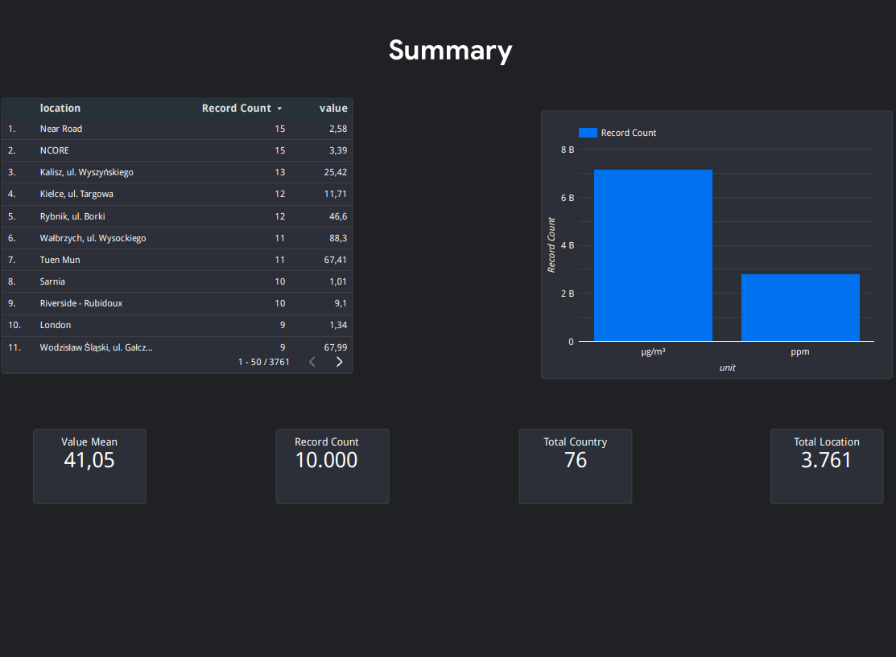
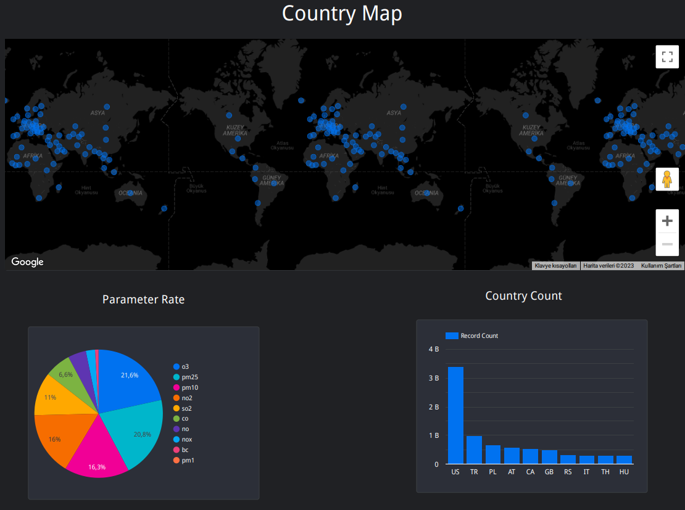

# Data Analysis Project

In this project, initially, data related to air quality was extracted from an open-source API. There is no need for any key or authentication process to use this API. The data was retrieved from the API using the extract_data.py script and then written to a JSON file. Subsequently, this JSON file was parsed using the json_parse.py script and converted into a CSV file. The drop_column.py script removed the city column with NULL values from the dataset. Afterward, the CSV file was loaded into BigQuery. From there, data was analyzed using Looker Studios, some parts were visualized, and a dashboard was created.

<a href="https://docs.openaq.org/docs" target="_blank">API DOCS</a>

<a href="https://docs.openaq.org/reference/measurements_get_v2_measurements_get" target="_blank">GET DATA</a>

<h1>Data Report</h1>

